<div align="center">


<br/>

<a href="https://www.python.org/"></a>


<a href="LICENSE"></a>

</div>

## WifeBot

Your AI co‑pilot for modern dating — stealthy browser automation, prompt‑engineered charm, and per‑platform personas for Bumble, Tinder, Hinge, and OkCupid.

### ✨ Highlights

- **Multi-platform**: 🐝 Bumble, 🔥 Tinder, 💘 Hinge, 🎯 OkCupid
- **Config-first**: Central JSON config via XDG (`~/.config/wifebot/config.json`)
- **Promptable**: Templated base task + platform-specific instructions in `prompts/`
- **CLI UX**: One command, interactive mode, or run all platforms
- **Traces & profiles**: Separate per-platform browser profiles and trace folders

---

### 🚀 Quickstart

Prereqs: Python 3.13+, an OpenAI-compatible API key in your environment, and either `uv` or `pip`.

1) Install

```bash
# Using uv (recommended)
uv sync

# OR using pip
python3.13 -m venv .venv
source .venv/bin/activate
pip install -e .
```

2) Configure

Create `~/.config/wifebot/config.json` (XDG location). Minimal example (see `examples/config.json`):

```json
{
  "llm": { "model": "gpt-5-mini" },
  "browser": {
    "headless": false,
    "minimum_wait_page_load_time": 1,
    "maximum_wait_page_load_time": 10,
    "viewport": { "width": 1280, "height": 1100 }
  },
  "paths": {
    "profile_dir_template": "~/.config/browseruse/profiles/{platform}",
    "trace_path_template": "/tmp/wifebot/{platform}"
  },
  "user_profile": {
    "gender": "man",
    "looking_for": "woman",
    "personality_traits": ["Funny", "Direct", "Honest", "Confident"],
    "preferences": ["Age: 20-30", "Non-smoker"]
  },
  "engagement": {
    "default_language": "Hebrew",
    "fallback_language": "English",
    "guidelines": [
      "Be concise and authentic",
      "Reference profile details",
      "Ask engaging follow-ups"
    ]
  }
}
```

3) Run

```bash
# Tinder, headless
wifebot tinder --headless

# Hinge with custom viewport and verbose logging
wifebot hinge --viewport-width 1920 --viewport-height 1080 --verbose

# OkCupid with custom model
wifebot okcupid --model gpt-4o-mini

# Run all platforms sequentially
wifebot all --headless --trace-path /tmp/traces

# Interactive selector
wifebot --interactive
```

---

### 🎛️ Demo


---

### 🧠 How it works

- `wifebot.platform.Platform`: Base runner that wires your config into a `browser_use` `BrowserSession` and an LLM-backed `Agent`.
- `wifebot.factory.PlatformFactory`: Builds CLI, normalizes flags, creates platforms, and supports interactive/all modes.
- `wifebot/*Platform` (e.g., `TinderPlatform`): Implements `name`, `url`, and `platform_instructions`.
- Prompts: `prompts/base_task.tpl` + `{platform}_instructions.txt` are concatenated at runtime to generate the agent’s task.

Directory map:

```text
wifebot/
  platform.py        # Base Platform
  factory.py         # CLI + orchestration
  main.py            # CLI entrypoint (console script: wifebot)
  bumble.py | tinder.py | hinge.py | okcupid.py
prompts/
  base_task.tpl
  bumble_instructions.txt | tinder_instructions.txt | ...
```

---

### 🧰 CLI reference

Positional:

- `platform`: `bumble | tinder | hinge | okcupid | all`

Flags:

- `--interactive`: Menu to select a platform
- `--config <path>`: JSON config path (defaults to XDG `~/.config/wifebot/config.json`)
- `--headless`: Run browser headlessly
- `--viewport-width <int>` / `--viewport-height <int>`
- `--min-wait <float>` / `--max-wait <float>`: Page load waits
- `--profile-dir <path>`: Override browser profile directory
- `--trace-path <path>`: Override trace directory
- `--model <name>`: LLM model (default from config)
- `--verbose`: Extra logging

Defaults (if not overridden by flags or config):

- Viewport: 1280x1100
- Waits: 1s min, 10s max
- Profile dir template: `~/.config/browseruse/profiles/{platform}`
- Trace path template: `/tmp/wifebot/{platform}`

---

### ⚙️ Configuration details

- Config resolution priority: CLI flags > config file > constructor defaults.
- Default config location: `~/.config/wifebot/config.json` (XDG respected).
- Paths support `{platform}` placeholder (expanded at runtime) for per-platform isolation.

Prompts and templates:

- Edit `prompts/base_task.tpl` to change the global agent persona/behavior.
- Edit platform instruction files (e.g., `prompts/tinder_instructions.txt`) to tune site-specific behavior.
- You can also render templates with Jinja expressions in templates if needed.

---

### 🌍 Environment

This project uses `browser-use` + an OpenAI-compatible chat model.

Set your API key before running, e.g.:

```bash
export OPENAI_API_KEY=sk-...    # or load via .env
```

`python-dotenv` is loaded at runtime, so a local `.env` file is also supported.

---

### 🛠️ Development

```bash
# Install dev env
uv sync

# Run CLI from source
uv run wifebot --interactive

# Example: ruff, mypy (not included by default)
```

---

### 🧯 Safety, ethics, and platform policies

- Automation may violate some platforms’ Terms of Service; proceed at your own risk.
- Use respectful, non-discriminatory language and comply with applicable laws.
- Obtain informed consent where appropriate and avoid impersonation or deception.
- Logs and traces can contain sensitive data; handle and store them securely.

---

### ❓ FAQ

- Q: Where is the config file loaded from by default?
  - A: `~/.config/wifebot/config.json` (XDG default). Override with `--config`.

- Q: Can I change the LLM model per run?
  - A: Yes, use `--model`. Otherwise it reads from the config file.

- Q: How do I customize behavior?
  - A: Edit `prompts/base_task.tpl` and the `{platform}_instructions.txt` files.

---

### 📄 License

Licensed under the MIT License. See [`LICENSE`](LICENSE) for details.

---

### 🗺️ Architecture (Mermaid)

```mermaid
flowchart TD;
  U[User / CLI] -->|args| F[PlatformFactory];
  F -->|create| P[Platform];
  P -->|compose| T[Task = base_task.tpl + platform_instructions];
  P -->|configure| B[BrowserSession];
  P -->|configure| L[LLM ChatOpenAI];
  B --> A[Agent];
  L --> A;
  A -->|navigate| Site[(Dating Platform)];

  subgraph Config
    C1[~/.config/wifebot/config.json];
    C2[prompts/];
  end
  F --> C1;
  P --> C1;
  P --> C2;
```


